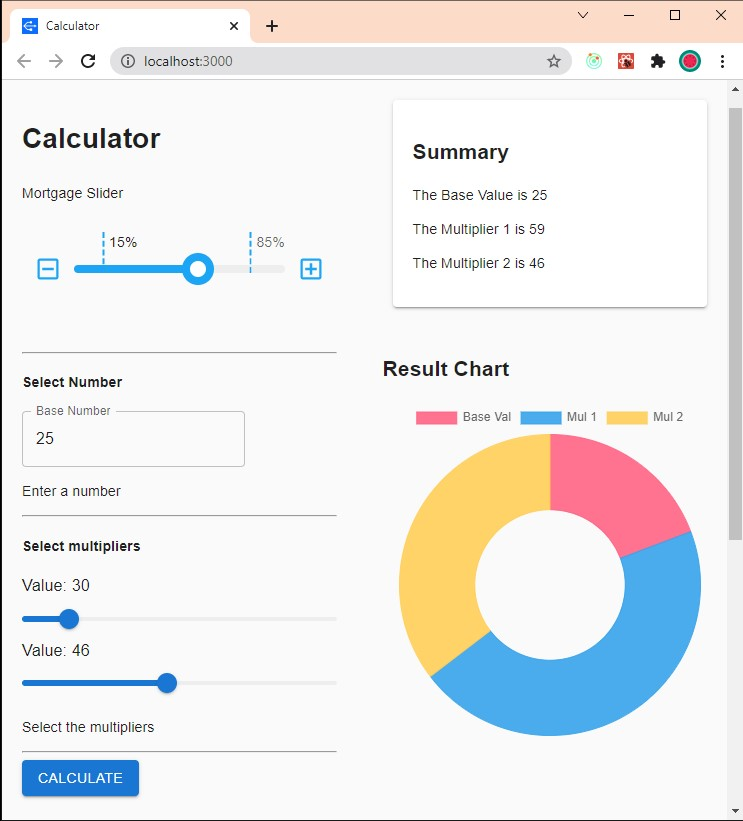
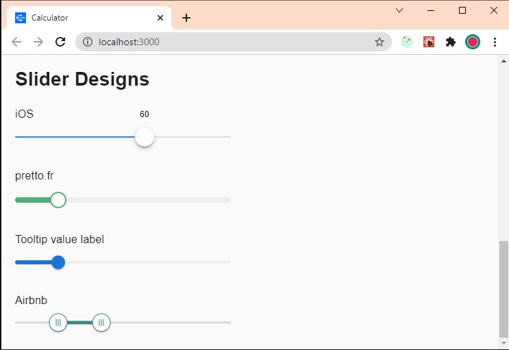

# Sliders for Calculators

Visit the live site.
https://praveendias1180.github.io/m-calc/

# Mortgage Slider

When you drag the slider beyond 85%, it shows you a snack bar. In this snack bar, there is an UNDO button. When you click, it changes the value back to 85%. This is useful functionality for mortgage calculators. Because the loan amount should be less than 85% of the underlying security.

https://praveendias1180.github.io/m-calc/

# Slider Designs

MUI slider can be customized in many ways. Below are some examples given on the official MUI website. The mortgage slider shown above is a modification to the default sliders in MUI.

https://praveendias1180.github.io/m-calc/
